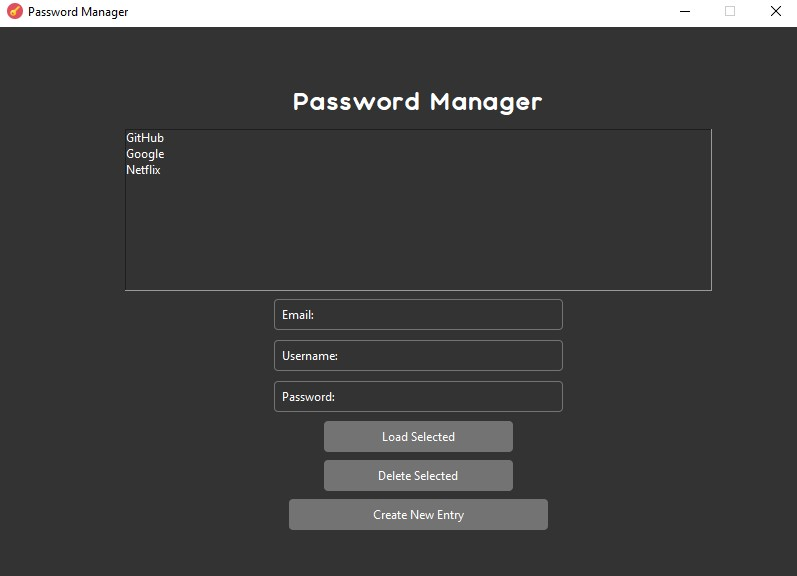

  


<!-- PROJECT LOGO -->
<br />
<div align="center">
  <a href="https://github.com/kiisuhh/Password-Manager">
  </a>

<h3 align="center">Password Manager</h3>

  <p align="center">
    GUI Password Manager with encrypted json written in python
    <br />
    <br />
    ·
    <a href="https://github.com/kiisuhh/Password-Manager/issues">Report Bug</a>
    ·
    <a href="https://github.com/kiisuhh/Password-Manager/issues">Request Feature</a>
  </p>
</div>


<!-- ABOUT THE PROJECT -->
## About The Project




<p align="right">(<a href="#top">back to top</a>)</p>


### Built With

* [python](https://www.python.org/)
* [tkinter](https://www.kite.com/python/docs/tkinter/)
* [cryptography](https://pypi.org/project/cryptography/)
* [json](https://www.json.org/)

<p align="right">(<a href="#top">back to top</a>)</p>


<!-- GETTING STARTED -->
## Getting Started

### Installation

1. Clone the repo
   ```sh
   git clone https://github.com/kiisuhh/Password-Manager.git
   ```
3. Install required packages
   ```sh
   pip install -r requirements.txt
   ```

<p align="right">(<a href="#top">back to top</a>)</p>


<!-- ROADMAP -->
## Roadmap

- [X] Password Secured
- [X] Encrypted
- [ ] Multiple Languages
    - [X] English
    - [ ] Deutsch


<p align="right">(<a href="#top">back to top</a>)</p>


<!-- CONTRIBUTING -->
## Contributing

Contributions are what make the open source community such an amazing place to learn, inspire, and create. Any contributions you make are **greatly appreciated**.

If you have a suggestion that would make this better, please fork the repo and create a pull request. You can also simply open an issue with the tag "enhancement".
Don't forget to give the project a star! Thanks again!

1. Fork the Project
2. Create your Feature Branch (`git checkout -b feature/AmazingFeature`)
3. Commit your Changes (`git commit -m 'Add some AmazingFeature'`)
4. Push to the Branch (`git push origin feature/AmazingFeature`)
5. Open a Pull Request

<p align="right">(<a href="#top">back to top</a>)</p>


<!-- CONTACT -->
## Contact

Discord: kiisuhh#2750

Project Link: [https://github.com/kiisuhh/Password-Manager](https://github.com/kiisuhh/Password-Manager)

<p align="right">(<a href="#top">back to top</a>)</p>
